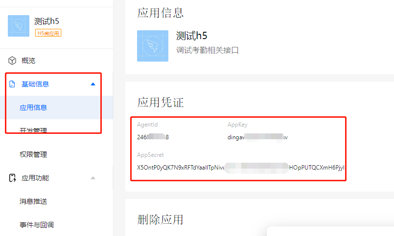

### 钉钉扫码登陆

> 钉钉后台H5微应用， 钉钉扫码登陆第三方网站


文档地址 https://open.dingtalk.com/document/isvapp/sso-overview?spm=a2q3p.21071111.0.0.4e32JmcHJmcH6H

文档地址 https://open.dingtalk.com/document/isvapp/tutorial-enabling-login-to-third-party-websites?spm=ding_open_doc.document.0.0.25c0d394PFf1dr

参考文档:

https://blog.csdn.net/qq_45772124/article/details/124062904


参考文档2

https://blog.csdn.net/weixin_43260238/article/details/126855205


h5:

2469827218

dingawgwjhuiobn9j9uv

X5OntP0yQK7N9xRFTdYaaIlTpNivuD1L-v0iMrhQRETZtmWaHOpPUTQCXmH6Pjyl


https://oapi.dingtalk.com/connect/qrconnect?appid=APPID&response_type=code&scope=snsapi_login&state=STATE&redirect_uri=REDIRECT_URI


* 钉钉内免登第三方网站

https://oapi.dingtalk.com/connect/oauth2/sns_authorize?appid=APPID&response_type=code&scope=snsapi_auth&state=STATE&redirect_uri=REDIRECT_URI


* **使用钉钉账号登录第三方网站**

https://oapi.dingtalk.com/connect/oauth2/sns_authorize?appid=APPID&response_type=code&scope=snsapi_login&state=STATE&redirect_uri=REDIRECT_URI


* h5登录钉钉

  > https://oapi.dingtalk.com/connect/oauth2/sns_authorize?appid=dingawgwjhuiobn9j9uv&response_type=code&scope=snsapi_login&state=STATE&redirect_uri=http://localhost:8001/cpmsService/dingding/auth

  


``` json

https://login.dingtalk.com/oauth2/auth?
redirect_uri=https%3A%2F%2Fwww.aaaaa.com%2Fauth
&response_type=code
&client_id=dingxxxxxxx   //应用的AppKey 
&scope=openid   //此处的openId保持不变
&state=dddd
&prompt=consent

https://login.dingtalk.com/oauth2/auth?redirect_uri=http://localhost:8001/cpmsService/auth&response_type=code&client_id=dingawgwjhuiobn9j9uv&scope=openid&state=dddd
&prompt=consent

```


#### 1.创建 H5微应用

> 钉钉后台

https://open-dev.dingtalk.com/fe/app#/corp/app


#### 2. 获取到 appKey与appSecret

> 微应用 ->  基础信息 -> 应用信息




#### 3.申请登录权限

> 供三方应用api调用

https://open.dingtalk.com/document/orgapp/add-api-permission

1.登录开发者后台-点击应用开发-企业内部应用，找到对应的应用并点击。

2.单击**权限管理**进入权限管理页面，根据以下配置添加接口调用权限。

（1）权限范围选择**全部员工**。

（2）选择**个人权限**，申请**个人手机号信息**和**通讯录个人信息读权限。**


#### 4. 微应用 -> 应用功能-> 登陆与分享 下面配置回调域名

> 调试阶段可以配置局域网地址


#### 5. 编码


##### 5.1 前端编码

> html

``` javascript
// 前端调用 下面接口跳转钉钉扫码登录页面
//钉钉登录成功后转发的url，会对此url发送这个钉钉账号的 authCode ，用于后端登录获取到真实手机号等信息
let redirect_uri = encodeURIComponent(window.location.origin + "/login"); 
//钉钉h5应用对应的 appKey
let client_id = "xxxxxxxx";

"https://login.dingtalk.com/oauth2/auth?redirect_uri="+redirect_uri+"&response_type=code&client_id="+client_id+"&scope=openid&state=dddd&prompt=consent";


```


##### 5.2 后端编码

> java

```java

 /**
     * 钉钉授权码登录
     * @param jsonObject  授权码
     */
    @RequestMapping(value = "/auth",method = RequestMethod.POST)
    //@ApiOperation("钉钉授权码登录")
    public Result dingTalkLogin(@RequestBody JSONObject jsonObject) throws Exception {
        String authCode = jsonObject.getString("authCode");
        if(TextUtil.isNullOrEmpty(authCode)){
            throw new BizException("请求参数不能为空! authCode ");
        }
        Client client = DingTalkAuthClient.oauth2Client();
        GetUserTokenRequest tokenRequest = new GetUserTokenRequest()
                .setClientId(appKey)
                .setClientSecret(appSecret)
                .setCode(authCode)
                .setGrantType("authorization_code");
        GetUserTokenResponse tokenResponse = client.getUserToken(tokenRequest);
        String accessToken = tokenResponse.getBody().getAccessToken();
        // 根据用户凭证调用钉钉开放接口获取用户信息
        GetUserResponseBody userInfo = DingTalkAuthClient.getUserInfo(accessToken);
        // TODO 这里获取钉钉绑定的手机号，当然你也可以进一步去获取unionid或userid（具体根据自己实际业务去实现）
        String mobile = userInfo.getMobile();
        if(mobile == null) {
            return ResultUtil.error(202, "该钉钉没有绑定手机号");
        }
        // TODO 这里根据绑定的钉钉手机号获取用户凭证token（具体根据自己实际业务去实现）
        return loginByMobile(mobile);
    }


```


#### 6. 登录验证

> 扫码成员在企业内和不在企业内返回数据格式不一样，需注意，都能获取到手机号


