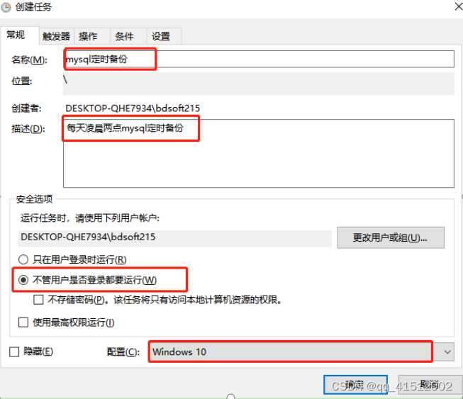
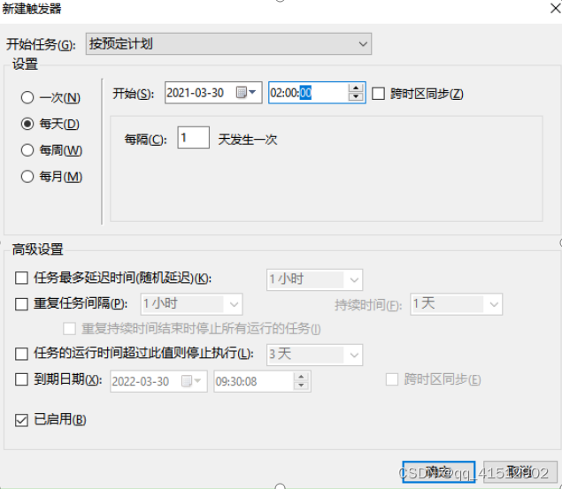
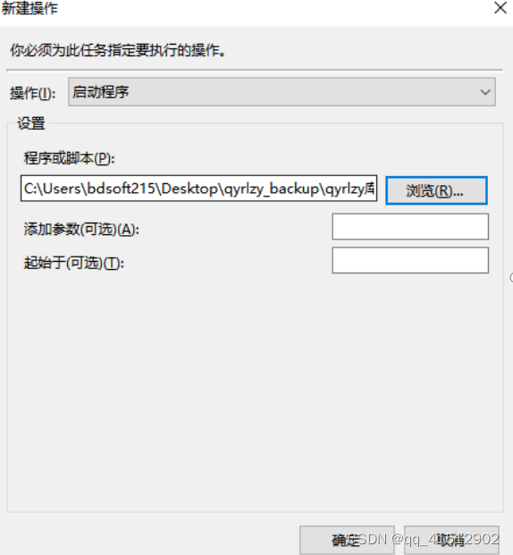

[参考文档](https://blog.csdn.net/qq_41512902/article/details/125564186)

#### 一. 介绍
本文章主要介绍了windows系统下如何创建mysql定时备份任务，目的：一是数据无价，一旦数据丢失，功亏一篑；而是将重复性的工作交给机器来做，省去人工处理成本。

#### 二.创建bat任务脚本
1. 新建txt文档

2. 打开txt文档，并粘贴入以下内容

   1. 备份规则1

      ``` shell
      @echo off
      
      @echo 开始备份数据库   //命令行窗口中显示此条信息
      
      set hour=%Time:~0,2%     //将hour设置为此刻小时位的时间，从0位置开始取2位
      
      if "%Time:~0,1%"==" " set hour=0%Time:~1,1%      //（小时位如果是个位数例如9点，则默认不是09，而是 9，前一位位空）判断小时位第一位是否为空，如果为空则添加上0，如果不为空则不执行，hour为前一条语句设置的。
      
      set now=%Date:~0,4%%Date:~5,2%%Date:~8,2%-%hour%%Time:~3,2%%Time:~6,2%     //获取具体时间
      
      set host=localhost     //设置数据库的ip地址
      
      set port=3306   //设置数据库端口号
      
      set user=root   //设置用户名
      
      set pass=lihui   //设置用户密码
      
      set dbname=zcfz_test1  //设置数据库名称
      
      set back_path=C:\Users\bdsoft215\Desktop  //设置备份的数据库的存储文件夹路径，注意路径不能有中文，且路径中文件夹需提前创建好
      
      set backupfile=%back_path%\%dbname%-%now%.sql    //设置每次备份的数据库名称（此处为“数据库名-时间”）
      
      "C:\Program Files\MySQL\MySQL Server 5.7\bin\mysqldump" -h%host% -P%port% -u%user% -p%pass% -c --add-drop-table %dbname% > %backupfile% //备份数据库的语句。（前方引号中的路径，为数据库安装目录下，mysqldump.exe程序的路径）
      
      @echo 数据库备份成功  //命令行窗口中显示此条信息
      
      @echo 删除2天前备份的文件 //命令行窗口中显示此条信息
      
      ```

      

   2. 备份规则2

      ``` shell
      
      
      @echo off
      echo.
      echo      MySQL数据库备份
       
      echo *****************************
      echo.
      echo 今天是 %date%
      echo 时间是 %time%
      echo.
      echo *****************************
       
       
      set "Ymd=%date:~,4%%date:~5,2%%date:~8,2%"
       
      md "F:\db_backup\xcheng01"
       
      :: "C:\Program Files\MySQL\MySQL Server 8.0\bin\mysqldump" --opt -Q -uroot -proot --default-character-set=utf8 xcheng01 > F:\db_backup\xcheng01\xcheng01_%Ymd%.sql
       
      echo 删除20天前的完整备份日志
      
      forfiles -p "F:\db_backup\xcheng01" /s /m *.sql /d -20  /c "cmd /c del @path"
      
      echo.
       
      echo MySQL数据库备份完成，请进行检查。。。
       
      echo.
      echo.
      
      ::pause 
      
      
      ```
      
      

3. 按照自己的需求对内容进行修改，并删除掉//后内容以及中文空格，否则会运行失败
4. 保存，并将文件后缀修改为.bat格式
5. 双击测试程序是否能正常运行，如果正常，会弹出cmd运行窗口，运行完后会自动停止，此时会在路径下产生备份文件。

#### 三.创建定时任务
1. 打开控制面板 > 管理工具 > 任务计划程序，创建任务：



2. 填写触发器，设定执行时间：



3. 添加执行脚本文件
将刚才创建好的bat文件选中。



4. 若要测试定时任务是否成功，可以将触发器的时间提前。
至此，大功告成，系统将会在指定时间会定时备份mysql数据库。