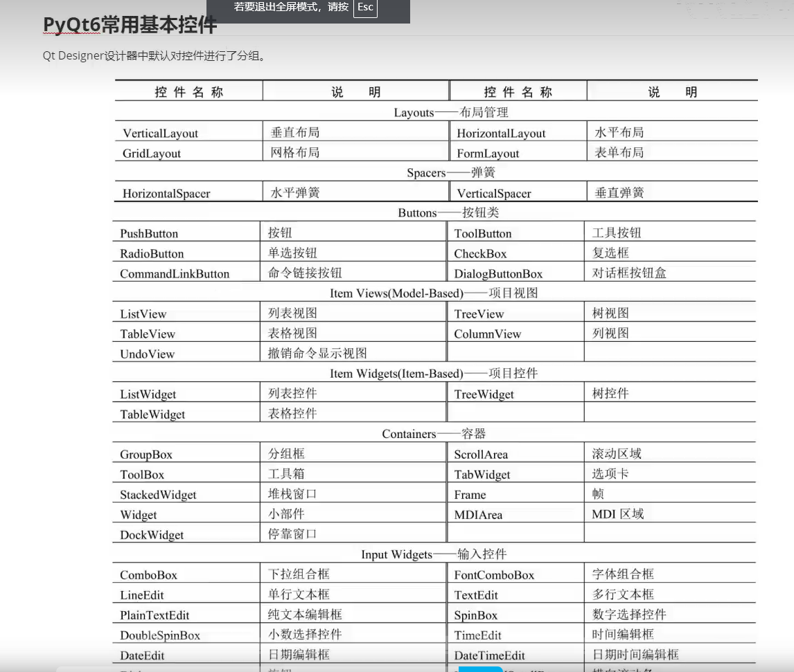

#### 配置环境

> pip安装好pyqt5或pyqt6后
>
> pycharm进入设置->外部工具->点击添加

* pycharm配置pydisner

  > 选择程序: D:\softs\python3.13.0_32bit\Lib\site-packages\qt5_applications\Qt\bin\designer.exe
  >
  > 实参：$FileName$
  >
  > 工作目录:  $ProjectFileDir$

* pycharm配置pyuic

  > 选择程序: E:\codetest\python\PyQtTest1\venv\Scripts\python.exe
  >
  > 实参：-m PyQt6.uic.pyuic $FileName$ -o $FileNameWithoutExtension$.py
  >
  > 工作目录:  $FileDir$