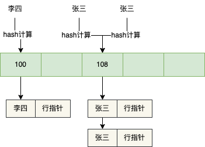
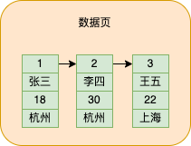
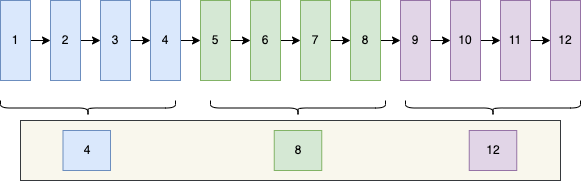
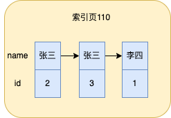
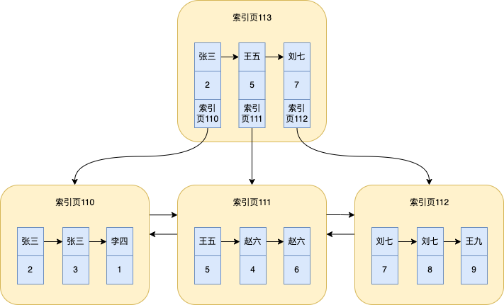

今天来盘点一下关于MySQL索引常见的知识点

不过不要紧，好饭不怕晚，虽迟但到，走起，开干！


对了，本文主要是针对InnoDB存储引擎进行讲解。

## 索引分类

索引的分类可以从不同的维度进行分类

##### 1、按使用的数据结构划分

- B+树索引
- Hash索引
- ...

##### 2、按实际的物理存储数据构划分

- 聚簇索引
- 非聚簇索引（二级索引）

聚簇索引和非聚簇索引后面会着重说。

##### 3、按索引特性划分

- 主键索引
- 唯一索引
- 普通索引
- 全文索引
- ...

##### 4、按字段个数划分

- 单列索引
- 联合索引

## 索引数据结构

#### 准备

为了接下来文章更好地讲解，这里我准备了一张`user`表，接下来整篇文章的示例会以这张表来讲解

```
CREATE TABLE `user` (
  `id` int(10) NOT NULL AUTO_INCREMENT,
  `name` varchar(255) DEFAULT NULL,
  `age` int(10) DEFAULT NULL,
  `city` varchar(255) DEFAULT NULL,
  PRIMARY KEY (`id`)
) ENGINE=InnoDB DEFAULT CHARSET=utf8mb4;
```

#### Hash索引

Hash索引其实用的不多，最主要是因为最常见的存储引擎InnoDB不支持显示地创建Hash索引，只支持自适应Hash索引。

虽然可以使用sql语句在InnoDB显示声明Hash索引，但是其实是不生效的


对name字段建立Hash索引，但是通过`show index from 表名`就会发现实际还是B+树


在存储引擎中，Memory引擎支持Hash索引

Hash索引其实有点像Java中的HashMap底层的数据结构，他也有很多的槽，存的也是键值对，键值为索引列，值为数据的这条数据的行指针，通过行指针就可以找到数据

假设现在`user`表用Memory存储引擎，对name字段建立Hash索引，表中插入三条数据


Hash索引会对索引列name的值进行Hash计算，然后找到对应的槽下面，如下图所示



当遇到name字段的Hash值相同时，也就是Hash冲突，就会形成一个链表，比如有name=张三有两条数据，就会形成一个链表。

之后如果要查name=李四的数据，只需要对李四进行Hash计算，找到对应的槽，遍历链表，取出name=李四对应的行指针，然后根据行指针去查找对应的数据。

**Hash索引优缺点**

- hash索引只能用于等值比较，所以查询效率非常高
- 不支持范围查询，也不支持排序，因为索引列的分布是无序的

#### B+树

B+树是mysql索引中用的最多的数据结构，这里先不介绍，下一节会着重介绍。

> 除了Hash和B+树之外，还有全文索引等其它索引，这里就不讨论了

## 聚簇索引

#### 数据页数据存储

我们知道，我们插入表的数据其实最终都要持久化到磁盘上，InnoDB为了方便管理这些数据，提出了**页**的概念，它会将数据划分到多个页中，每个页大小默认是16KB，这个页我们可以称为数据页。

当我们插入一条数据的时候，数据都会存在数据页中，如下图所示


当数据不断地插入数据页中，数据会根据主键（没有的话会自动生成）的大小进行排序，形成一个单向链表



> 数据页中除了会存储我们插入的数据之外，还会有一部分空间用来存储额外的信息，额外的信息类型比较多，后面遇到一个说一个

#### 单个数据页的数据查找

既然数据会存在数据页中，那么该如何从数据页中去查数据呢？

假设现在需要在数据页中定位到id=2的这条记录的数据，如何快速定位？

有一种笨办法就是从头开始顺着链表遍历就行了，判断id是不是等于2，如果等于2就取出数据就行了。

虽然这种方法可行，但是如果一个数据页存储的数据多，几十或者是几百条数据，每次都这么遍历，不是太麻烦了

所以mysql想了一个好办法，那就是给这些数据分组

假设数据页中存了12条数据，那么整个分组大致如下图所示



为了方便了，我这里只标出了id值，省略了其它字段的值

这里我假设每4条数据算一个组，图上就有3个组，组分好之后，mysql会取出每组中**最大的id**值，就是图中的4、8、12，放在一起，在数据页中找个位置存起来，这就是前面提到的数据页存储的额外信息之一，被称为**页目录**

假设此时要查询id=6的数据之后，此时只需要从页目录中根据二分查找，发现在4-8之间，由于4和8是他们所在分组的最大的id，那么id=6肯定在8那个分组中，之后就会到id=8的那个分组中，遍历每个数据，判断id是不是等于6即可。

由于mysql规定每个组的数据条数大概为4~8条，所以肯定比遍历整个数据页的数据快的多

> 上面分组的情况实际上我做了一点简化，但是不耽误理解

#### 多个数据页中的数据查找

当我们不断的往表中插入数据的时候，数据占用空间就会不断变大，但是一个数据页的大小是一定的，当一个数据页存不下数据的时候，就会重新创建一个数据页来存储数据

' fill='%23FFFFFF'%3E%3Crect x='249' y='126' width='1' height='1'%3E%3C/rect%3E%3C/g%3E%3C/g%3E%3C/svg%3E)

mysql为了区分每个页，会为每个数据页分配一个页号，存在额外信息的存储空间中，同时额外信息还会存储当前数据页的前一个和后一个数据页的位置，从而形成数据页之间的双向链表

' fill='%23FFFFFF'%3E%3Crect x='249' y='126' width='1' height='1'%3E%3C/rect%3E%3C/g%3E%3C/g%3E%3C/svg%3E)

数据页2的页号就是2，数据页3的页号就是3，这里我为了方便理解，就直接写数据页几。

并且mysql规定，前一个数据页的存储数据id的最大值要小于后一个数据页的存储数据id的最小值，这样就实现了数据在所有数据页中**按照id的大小排序**。

现在，如果有多个数据页，当我们需要查找id=5的数据，怎么办呢？

当然还是可以用上面的笨办法，那就是从第一个数据页开始遍历，然后遍历每个数据页中的数据，最终也可以找到id=5的数据。

但是你仔细想想，这个笨办法就相当于全表扫描了呀，这肯定是不行的。

那么怎么优化呢？

mysql优化的思路其实跟前面单数据页查找数据的优化思路差不多

它会将每个数据页中**最小的id**拿出来，单独放到另一个数据页中，这个数据页不存储我们实际插入的数据，只存储**最小的id**和这个id所在数据页的页号，如图所示


为了图更加饱满，我加了一个存放数据的数据页4

此时数据页5就是抽取出来的，存放了下面三个存放数据的数据页的最小的id和对应的数据页号

如果此时查找id=5的数据就很方便了，大致分为以下几个步骤：

- 从数据页5直接根据二分查找，发现在4-7之间
- 由于4和7是所在数据页最小的id，那么此时id=5的数据必在id=4的数据页上(因为id=7的数据页最小的id就是7)，
- 接下来就到id=4对应的数据页2的页号找到数据页2
- 之后再根据前面提到的根据数据的主键id从单个数据页查找的流程查找数据

这样就实现了根据主键id到在多个数据页之间查找数据

#### 聚簇索引

随着数据量不断增多，存储数据的数据页不断变多，数据页5的数据就会越来越多，但是每个数据页默认就16k，所以数据页5也会分裂出多个数据页的情况，如下图


数据页10的作用就跟数据页5是一样的

此时如还要查找id=5的数据，那么应该去数据页5进行二分查找呢还是去数据页10进行二分查找呢？

笨办法就是遍历，但是真没必要，mysql会去抽取数据页5和数据页10存储的最小的数据的id和对应的数据页号，单独拎出来放到一个数据页中，如下图

' fill='%23FFFFFF'%3E%3Crect x='249' y='126' width='1' height='1'%3E%3C/rect%3E%3C/g%3E%3C/g%3E%3C/svg%3E)

数据页11就是新抽取的数据页，存储了id=1和对应的数据页5的页号以及数id=10和对应的数据页10的页号

而这就是**B+树**。

> 一般来说，mysql数据库的B+树一般三层就可以放下几千万条数据

此时查找id=5的数据，大致分为以下几个步骤：

- 从数据页11根据二分查找定位到id=5对应数据页5
- 再到数据页5根据id=5二分查找定位到数据页3
- 再到数据页3根据id=5查找数据，具体的逻辑前面也提到很多次了

这样就能成功查找到数据了

而这种叶子节点存储实际插入的数据的B+树就被称为**聚簇索引**，非叶子节点存储的就是记录的id和对应的数据页号。

所以对于InnoDB存储引擎来说，数据本身就存储在一颗B+树中。

## 二级索引

二级索引也被称为非聚簇索引，本身也就是一颗B+树，一个二级索引对应一颗B+树，但是二级索引B+树存储的数据跟聚簇索引不一样。

聚簇索引前面也说了，叶子节点存的就是我们插入到数据库的数据，非叶子节点存的就是数据的主键id和对应的数据页号。

而二级索引叶子节点存的是索引列的数据和对应的主键id，非叶子节点除了索引列的数据和id之外，还会存数据页的页号。

> 前面提到的数据页，其实真正是叫索引页，因为叶子节点存的是实际表的数据，所以我就叫数据页了，接下来因为真正要讲到索引了，所以我就将二级索引的页称为索引页，你知道是同一个，但是存储的数据不一样就可以了。

#### 单列索引

假设，我们现在对name字段加了一个普通非唯一索引，那么name就是索引列，同时name这个索引也就是单列索引

此时如果往表中插入三条数据，那么name索引的叶子节点存的数据就如下图所示



**mysql会根据name字段的值进行排序，这里我假设张三排在李四前面，当索引列的值相同时，就会根据id排序，所以索引实际上已经根据索引列的值排好序了。**

这里肯定有小伙伴疑问，name字段存储的中文也可以排序么？

答案是可以的，并且mysql支持很多种排序规则，我们在建数据库或者是建表的时候等都可以指定排序规则，**并且后面文章涉及到的字符串排序都是我随便排的，实际情况可能不一样**。


对于单个索引列数据查找也是跟前面说的聚簇索引一样，也会对数据分组，之后可以根据二分查找在单个索引列来查找数据。

当数据不断增多，一个索引页存储不下数据的时候，也会用多个索引页来存储，并且索引页直接也会形成双向链表


当索引页不断增多是，为了方便在不同索引页中查找数据，也就会抽取一个索引页，除了存页中id，同时也会存储这个id对应的索引列的值



当数据越来越多越来越多，还会抽取，也会形成三层的一个B+树，这里我就不画了。

#### 联合索引

除了单列索引，联合索引其实也是一样的，只不过索引页存的数据就多了一些索引列

比如，在name和age上建立一个联合索引，此时单个索引页就如图所示


**先以name排序，name相同时再以age排序，如果再有其它列，依次类推，最后再以id排序。**

相比于只有name一个字段的索引来说，索引页就多存了一个索引列。

最后形成的B+树简化为如下图


#### 小结

其实从上面的分析可以看出，聚簇索引和非聚簇索引主要区别有以下几点

- 聚簇索引的叶子节点存的是所有列的值，非聚簇索引的叶子节点只存了索引列的值和主键id
- 聚簇索引的数据是按照id排序，非聚簇索引的数据是按照索引列排序
- 聚簇索引的非叶子节点存的是主键id和页号，非聚簇索引的非叶子节点存的是索引列、主键id、页号

由于后面这个索引树会经常用到，为了你方便比较，所以我根据上面索引树的数据在表中插入了对应的数据，sql在文末


实际情况下索引B+树可能并不是按照我图中画出来的那样排序，但不耽误理解。

## 回表

讲完二级索引，接下来讲一讲如何使用二级索引查找数据。

这里假设对name字段创建了一个索引，并且表里就存了上面示例中的几条数据，这里我再把图拿过来


那么对于下面这条sql应该如何执行？

```
select * from `user` where name = '赵六';
```

由于查询条件是`name = '赵六'`，所以会走name索引

整个过程大致分为以下几个步骤：

- 从最上面那层索引页开始二分查找，我们图中就是索引页113，如果索引页113上面还有一层，就从上面一层二分查找
- 在索引页113查找到`赵六`在`王五`和`刘七`之间，之后到`王五`对应的索引页111上去查找`赵六`
- 在索引页111找到`赵六`的第一条记录，也就是id=4的那条
- 由于是`select *`，还要查其它字段，此时就会根据id=4到聚簇索引中查找其它字段数据，这个查找过程前面说了很多次了，这个根据id=4到聚簇索引中查找数据的过程就被称为**回表**
- 由于是非唯一索引，所以`赵六`这个值可能会有重复，所以接着就会在索引页111顺着链表继续遍历，如果name还是`赵六`，那么还会根据id值进行回表，如此重复，一直这么遍历，直至name不再等于`赵六`为止，对于图示，其实就是两条数据

从上面的二级索引的查找数据过程分析，就明白了**回表**的意思，就是先从二级索引根据查询条件字段值查找对应的主键id，之后根据id再到聚簇索引查找其它字段的值。

## 覆盖索引

上一节说当执行`select * from user where name = '赵六';`这条sql的时候，会先从索引页中查出来`name = '赵六';`对应的主键id，之后再回表，到聚簇索引中查询其它字段的值。

那么当执行下面这条sql，又会怎样呢？

```
select id from `user` where name = '赵六';
```

这次查询字段从`select *`变成`select id`，查询条件不变，所以也会走name索引

所以还是跟前面一样了，先从索引页中查出来`name = '赵六';`对应的主键id之后，惊讶的发现，sql中需要查询字段的id值已经查到了，那次此时压根就不需要回表了，已经查到id了，还回什么表。

而这种需要查询的字段都在索引列中的情况就被称为**覆盖索引**，索引列覆盖了查询字段的意思。

当使用覆盖索引时会减少回表的次数，这样查询速度更快，性能更高。

> 所以，在日常开发中，尽量不要select * ，需要什么查什么，如果出现覆盖索引的情况，查询会快很多。

## 索引下推

假设现在对表建立了一个name和age的联合索引，为了方便理解，我把前面的图再拿过来

' fill='%23FFFFFF'%3E%3Crect x='249' y='126' width='1' height='1'%3E%3C/rect%3E%3C/g%3E%3C/g%3E%3C/svg%3E)

接下来要执行如下的sql

```
select * from `user` where name > '王五' and age > 22;
```

在MySQL5.6(不包括5.6)之前，整个sql大致执行步骤如下：

- 先根据二分查找，定位到`name > '王五'`的第一条数据，也就是id=4的那个赵六
- 之后就会根据id=4进行回表操作，到聚簇索引中查找id=4其它字段的数据，然后判断数据中的age是否大于22，是的话就说明是我们需要查找的数据，否则就不是
- 之后顺着链表，继续遍历，然后找到一条记录就回一次表，然后判断age，如此反复下去，直至结束

所以对于图上所示，整个搜索过程会经历5次回表操作，两个赵六，两个刘七，一个王九，最后符合条件的也就是id=6的赵六那条数据，其余age不符和。

虽然这么执行没什么问题，但是不知有没有发现其实没必要进行那么多次回表，因为光从上面的索引图示就可以看出，符合`name > '王五' and age > 22`的数据就id=6的赵六那条数据

所以在MySQL5.6之后，对上面的`age > 22`判断逻辑进行了优化

前面还是一样，定位查找到id=4的那个赵六，之后就**不回表**来判断age了，因为索引列有age的值了，那么直接根据索引中age判断是否大于22，如果大于的话，再回表查询剩余的字段数据（因为是`select *`），然后再顺序链表遍历，直至结束

所以这样优化之后，回表次数就成1了，相比于前面的5次，大大减少了回表的次数。

而这个优化，就被称为**索引下推**，就是为了减少回表的次数。

> 之所以这个优化叫索引下推，其实是跟判断`age > 22`逻辑执行的地方有关，这里就不过多赘述了。

## 索引合并

索引合并（index merge）是从MySQL5.1开始引入的索引优化机制，在之前的MySQL版本中，一条sql多个查询条件只能使用一个索引，但是引入了索引合并机制之后，MySQL在**某些特殊**的情况下会扫描多个索引，然后将扫描结果进行合并

结果合并会为下面三种情况：

- 取交集（intersect）
- 取并集（union）
- 排序后取并集（sort-union）

为了不耽误演示，删除之前所有的索引，然后为name和age各自分别创建一个二级索引idx_name和idx_age

#### 取交集（intersect）

当执行下面这条sql就会出现取交集的情况

```
select * from `user` where name = '赵六' and age= 22;
```

查看执行计划

' fill='%23FFFFFF'%3E%3Crect x='249' y='126' width='1' height='1'%3E%3C/rect%3E%3C/g%3E%3C/g%3E%3C/svg%3E)

type是`index_merge`，并且possible_key和key都是`idx_name`和`idx_age`，说明使用了索引合并，并且Extra有`Using intersect(idx_age,idx_name)`，intersect就是交集的意思。

整个过程大致是这样的，分别根据`idx_name`和`idx_age`取出对应的主键id，之后将主键id取交集，那么这部分交集的id一定同时满足查询`name = '赵六' and age= 22`的查询条件（仔细想想），之后再根据交集的id回表

不过要想使用取交集的联合索引，需要满足各自索引查出来的主键id是排好序的，这是为了方便可以快速的取交集

比如下面这条sql就无法使用联合索引

```
select * from `user` where name = '赵六' and age > 22;
```

' fill='%23FFFFFF'%3E%3Crect x='249' y='126' width='1' height='1'%3E%3C/rect%3E%3C/g%3E%3C/g%3E%3C/svg%3E)

只能用name这个索引，因为`age > 22`查出来的id是无序的，前面在讲索引的时候有说过索引列的排序规则

由此可以看出，使用联合索引条件还是比较苛刻的。

#### 取并集（union）

取并集就是将前面例子中的`and`换成`or`

```
select * from `user` where name = '赵六' or age = 22;
```

前面执行的情况都一样，根据条件到各自的索引上去查，之后对查询的id取并集去重，之后再回表

同样地，取并集也要求各自索引查出来的主键id是排好序的，如果查询条件换成`age > 22`时就无法使用取并集的索引合并

```
select * from `user` where name = '赵六' or age > 22;
```

#### 排序后取并集（sort-union）

虽然取并集要求各自索引查出来的主键id是排好序的，但是如果遇到没排好序的情况，mysql会自动对这种情况进行优化，会先对主键id排序，然后再取并集，这种情况就叫 排序后取并集（sort-union）。

比如上面提到的无法直接取并集的sql就符合排序后取并集（sort-union）这种情况

```
select * from `user` where name = '赵六' or age > 22;
```

## mysql如何选择索引

在日常生产中，一个表可能会存在多个索引，那么mysql在执行sql的时候是如何去判断该走哪个索引，或者是全表扫描呢？

mysql在选择索引的时候会根据索引的使用成本来判断

一条sql执行的成本大致分为两块

- IO成本，因为这些页都是在磁盘的，要想去判断首先得加载到内存，MySQL规定加载一个页的成本为1.0
- CPU成本，除了IO成本之外，还有条件判断的成本，也就是CPU成本。比如前面举的例子，你得判断加载的数据`name = '赵六'`符不符合条件，MySQL规定每判断一条数据花费的成本为0.2

#### 全表扫描成本计算

对于全表扫描来说，成本计算大致如下

mysql会对表进行数据统计，这个统计是大概，不是特别准，通过`show table status like '表名'`可以查看统计数据

' fill='%23FFFFFF'%3E%3Crect x='249' y='126' width='1' height='1'%3E%3C/rect%3E%3C/g%3E%3C/g%3E%3C/svg%3E)

比如这个表大致有多少条数据rows，以及聚簇索引所占的字节数data_length，由于默认是16kb，所以就可以计算出(data_length/1024/16)大概有多少个数据页。

所以全表扫描的成本就这么计算了

```
rows * 0.2 + data_length/1024/16 * 1.0
```

#### 二级索引+回表成本计算

二级索引+回表成本计算比较复杂，他的成本数据依赖两部分扫描区间个数和回表次数

为了方便描述扫描区间，这里我再把上面的图拿上来

' fill='%23FFFFFF'%3E%3Crect x='249' y='126' width='1' height='1'%3E%3C/rect%3E%3C/g%3E%3C/g%3E%3C/svg%3E)

```
select * from `user` where name = '赵六';
```

对着图看！

查询条件`name = '赵六'`就会产生一个扫描区间，从id=4的赵六扫描到id=6的赵六

又比如假设查询条件为`name > '赵六'`，此时就会产生一个从id=7的刘七开始直到数据结束（id=9的王九）的扫描区间

又比如假设查询条件为`name < '李四' and name > '赵六'`，此时就会产生两个扫描区间，从id=2的张三到id=3的张三算一个，从id=7的刘七开始直到数据结束算另一个

所以扫描区间的意思就是符合查询条件的记录区间

二级索引计算成本的时候，mysq规定读取一个区间的成本跟读取一个页的IO成本是一样的，都是1.0

区间有了之后，就会根据统计数据估计在这些区间大致有多少条数据，因为要读写这些数据，那么读取成本大致就是 条数 * 0.2

所以走二级索引的成本就是 `区间个数 * 1.0 + 条数 * 0.2`

之后这些数据需要回表（如果需要的话），mysql规定每次回表也跟读取一个页的IO成本是一样，也是1.0

回表的时候需要对从聚簇索引查出来的数据进行剩余查询条件的判断，就是CPU成本，大致为 条数 * 0.2

所以回表的成本大致为 `条数 * 1.0 + 条数 * 0.2`

所以二级索引+回表的大致成本为 `区间个数 * 1.0 + 条数 * 0.2 + 条数 * 1.0 + 条数 * 0.2`

当索引的成本和全表扫描的成本都计算完成之后，mysql会选择成本最低的索引来执行

> mysql对上述成本计算结果还会微调，但是微调的值特别小，所以这里我就省略了，并且这里也只是大致介绍了成本计算的规则，实际情况会更复杂，比如连表查询等等，有感兴趣的小伙伴查阅相关的资料

#### 小结

总的来说，这一节主要是让你明白一件事，mysql在选择索引的时候，会根据统计数据和成本计算的规则来计算使用每个索引的成本，然后选择使用最低成本的索引来执行查询

## 索引失效

在日常开发中，肯定或多或少都遇到过索引失效的问题，这里我总结一下几种常见的索引失效的场景

为了方便解释，这里我再把图拿过来

' fill='%23FFFFFF'%3E%3Crect x='249' y='126' width='1' height='1'%3E%3C/rect%3E%3C/g%3E%3C/g%3E%3C/svg%3E)

##### 不符和最左前缀匹配原则

当不符和最左前缀匹配原则的时候会导致索引失效

比如`like`以%开头，索引失效或者是联合索引没走第一个索引列。

比如name和age的联合索引，当执行`select * from user where name > '王五' and age > 22;`时，那么如果要走索引的话，此时就需要扫描整个索引，因为索引列是先以name字段排序，再以age字段排序的，对于age来说，在整个索引中来说是无序的，从图中也可以看出 18、23...9，无序，所以无法根据二分查找定位到`age > 22`是从哪个索引页开始的，

所以走索引的话要扫描整个索引，一个一个判断，最后还要回表，这就很耗性能，不如直接扫描聚簇索引，也就是全表扫描来的痛快。

##### 索引列进行了计算

当对索引进行表达式计算或者使用函数时也会导致索引失效

这个主要是因为索引中保存的是索引字段是原始值，从上面画的图可以看出来，当经过函数计算后的值，也就没办法走索引了

##### 隐式转换

当索引列发生了隐式转换**可能会**导致索引失效

举个例子，mysql规定，当字符串跟数字比较时，会把字符串先转成数字再比较，至于字符串怎么转成数字，mysql有自己的规则

比如说，当我执行了下面这条sql时就会发生隐式转换

```
select * from `user` where name = 9527;
```

name字段是个varchar类型，9527，没加引号，是数字，mysql根据规则会把`name`字段的值先转换成数字，再与9527比较，此时由于`name`字段发生了转换，所以索引失效了

' fill='%23FFFFFF'%3E%3Crect x='249' y='126' width='1' height='1'%3E%3C/rect%3E%3C/g%3E%3C/g%3E%3C/svg%3E)

ALL说明没走索引，失效了。

但是假设现在对age创建一个索引，执行下面这条sql

```
select * from `user` where age = '22';
```

此时age索引就不会失效，主要是因为前面说的那句话：

当字符串跟数字比较时，会把字符串先转成数字再比较

于是`'22'`会被隐式转成数字，之后再跟age比较，此时age字段并没有发生隐式转换，所以不会失效。

所以说，隐式转换**可能会**导致索引失效。

##### mysql统计数据误差较大

mysql统计数据误差较大也可能会导致索引失效，因为前面也说了，mysql会根据统计数据来计算使用索引的成本，这样一旦统计数据误差较大，那么计算出来的成本误差就大，就可能出现实际走索引的成本小但是计算出来的是走索引的成本大，导致索引失效

当出现这种情况时，可以执行`analyze table 表名`这条sql，mysql就会重新统计这些数据，索引就可以重新生效了

## 索引建立原则

#### 单个表索引数量不宜过多

- 从上面分析我们知道，每个索引都对应一颗B+树，并且叶子节点存储了索引列全量的数据，一旦索引数量多，那么就会占有大量磁盘空间
- 同时前面也提到，在查询之前会对索引成本进行计算，一旦索引多，计算的次数就多，也可能会浪费性能

#### 经常出现在where后的字段应该建立索引

这个就不用说了，索引就是为了加快速度，如果没有合适索引，就会全表扫描，对于InnoDB来说，全表扫描就是从聚簇索引的第一个叶子节点开始，顺着链表一个一个判断数据服不服合查询条件

#### order by、group by后字段可建立索引

比如下面这条sql

```
select * from `user` where name = '赵六' order by age asc;
```

查询`name = '赵六'`并且根据`age`排序，name和age联合索引

你可能记不清索树了，我把那个索引树拿过来


此时对着索引树你可以发现，当`name = '赵六'`时，`age`已经排好序了（前面介绍索引的说了排序规则），所以就可以使用`age`索引列进行排序。

#### 频繁更新的字段不宜建索引

因为索引需要保证按照索引列的值进行排序，所以一旦索引字段数据频繁更新，那么为了保证索引的顺序，就得频繁挪动索引列在索引页中的位置

比如name和age联合索引

此时把id=9这条数据的name从`王九`改成`赵六`，那么此时就把这条更改后的数据在索引页上移到王五和id=4的赵六之间，因为name相同时，得保证顺序性，同时要按照age排序，id=9的age为9，最小，那么排在最前。

所以频繁更新的字段建索引就会增加维护索引的成本。

#### 选择区分度高的字段做索引

这个是因为，如果区分度低，那么索引效果不好。

举个例子，假设现在有个性别字段sex，非男即女，如果对sex建索引，假设男排在女之前，那么索引页的数据排列大致如下：

' fill='%23FFFFFF'%3E%3Crect x='249' y='126' width='1' height='1'%3E%3C/rect%3E%3C/g%3E%3C/g%3E%3C/svg%3E)

这里我画了6条数据，假设有10w条数据那么也是这继续排，男在前，女子在后。

此时如果走sex索引，查询sex=男的数据，假设男女数据对半，那么就扫描的记录就有5w，之后如果要回表，那么根据成本计算规则发现成本是巨大的，那么此时还不如直接全表扫描来的痛快。

所以要选择区分度高的字段做索引

## 总结

到这，本文就结束了，这里回顾一下本文讲的内容

首先主要是讲了聚簇索引和非聚簇索引，随后讲了MySQL对于一些常见查询的优化，比如覆盖索引，索引下推，都是为了减少回表次数，从而减少带来的性能消耗，再后面就提到MySQL是如何选择索引的，最后介绍了索引失效的场景和索引建立的原则。

最后希望本文对你有所帮助！

最后的最后，表数据sql如下

```
INSERT INTO `user` (`id`, `name`, `age`, `city`) VALUES (1, '李四', 20, '杭州');
INSERT INTO `user` (`id`, `name`, `age`, `city`) VALUES (2, '张三', 18, '北京');
INSERT INTO `user` (`id`, `name`, `age`, `city`) VALUES (3, '张三', 23, '上海');
INSERT INTO `user` (`id`, `name`, `age`, `city`) VALUES (4, '赵六', 22, '杭州');
INSERT INTO `user` (`id`, `name`, `age`, `city`) VALUES (5, '王五', 19, '北京');
INSERT INTO `user` (`id`, `name`, `age`, `city`) VALUES (6, '赵六', 24, '上海');
INSERT INTO `user` (`id`, `name`, `age`, `city`) VALUES (7, '刘七', 20, '上海');
INSERT INTO `user` (`id`, `name`, `age`, `city`) VALUES (8, '刘七', 22, '上海');
INSERT INTO `user` (`id`, `name`, `age`, `city`) VALUES (9, '王九', 9, '杭州');
```

**参考：**

[1].《MySQL是怎样运行的》

[2].https://blog.csdn.net/weixin_44953658/article/details/127878350

[3].https://blog.csdn.net/taoqilin/article/details/121230649