## Konnex Tool 签名工具客户端程序设计


[axure设计文档地址](https://gylx8v.axshare.com/?g=14&id=ecfafp&p=%E8%B4%A6%E5%8F%B7%E7%99%BB%E5%BD%95&sc=3)


## 1. 概述

### 1.1 工具名称

 Konnex Tool


### 1.2 工具用途

本工具用于与 COM 口设备通信，实现证书导出、APK 签名和签名后 APK 导出功能，主要服务于前端客户需求发卡签名APK使用。


### 1.3 技术栈

- 开发语言：Python
- 开发工具：pycharm
- GUI 框架：PyQt6
- UI 设计工具：PyDesigner
- UI 转 Python 工具：PyUIC
- 串口通信库：PySerial
- 打包工具：PyInstaller


## 2. 系统架构

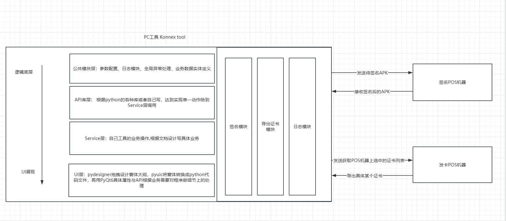

以上是本程序到全局整体架构图


### 2.1 整体架构

本工具采用单进程、多线程架构，分为以下几个功能模块：

- UI 模块：负责用户界面展示和交互

- 串口通信模块：负责与 COM 口设备进行数据传输

- 证书处理模块：负责证书导出相关操作

- APK 处理模块：负责 APK 文件的签名和导出

- 线程管理模块：负责处理耗时操作，防止 UI 卡顿

- 日志模块：用于记录签名和导出证书后的log日志

  

### 2.2 模块交互流程

1. 用户通过 UI 选择操作类型（证书导出或 APK 签名）
2. UI 模块收集用户输入参数（如 COM 口号、文件路径等）
3. 线程管理模块创建工作线程执行具体操作
4. 工作线程调用串口通信模块与设备通信
5. 工作线程根据操作类型调用证书处理模块或 APK 处理模块
6. 处理结果通过信号槽机制返回给 UI 模块更新界面


## 3. 功能详细说明

> 本节点列出常用一点的节点功能

### 3.1 UI界面设计与实现

> 先配置环境工具 pydesigner, 再通过界面拖拽出需要的界面(前置需要理解qt designer 中各个组件的特性才能拖拽出需要的控件)

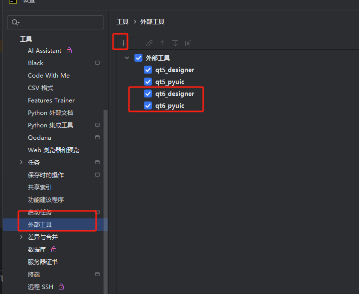

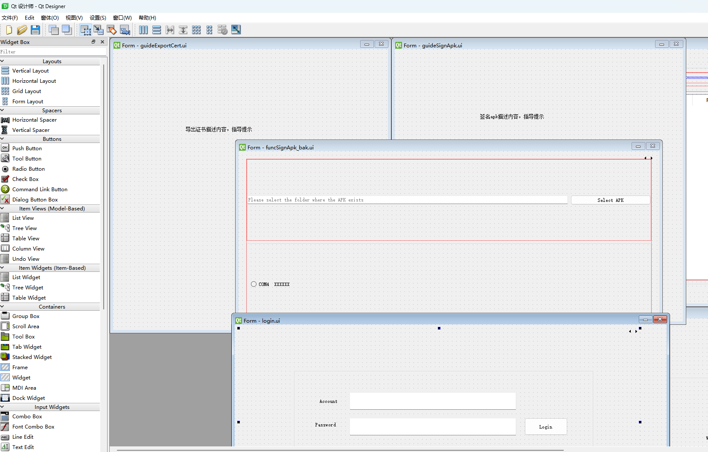


### 3.2 业务逻辑处理

> 业务处理时候需要引入**信号与槽** , 类似于android的intent ，信号与槽用于界面数据和业务层交互，
>
> 本次以举例将pyqt中常用性质功能举例
>
> 

* 信号与槽

  > 槽（Slot）是用于接收信号（Signal）的函数，二者共同构成了事件驱动编程的核心机制。

  ``` python
  # 定义信号
  finished = pyqtSignal(list)
  
  # 提交信号
  self.finished.emit(devices)
  
  # 槽
  def next_page(devices):
      """
      
      :return:
      """
      logger.info('do somthing.')
      
      pass
  # 连接型号与槽函数
  self.finished.connect(next_page)
  ```

* 执行业务操作

  > **界面为主线程, 不能做耗时操作,耗时操作以UI层为入口，封装调用到Service层，以启子线程调用处理Service里的业务逻辑, 再以信号发送通知到界面处理情况**

  ``` python
  # 定义子线程
  class CheckDevicesWorker(QThread):
      """ 检查设备是否连接动作 """
      finished = pyqtSignal(list)
      def run(self):
          try:
              devices = serial_func_service.check_normal_devices(LogType.RECEIVE_CERT)
              if not devices:
                  devices = []
              self.finished.emit(devices)
          except Exception as e:
              traceback.print_exc()
  
              
              
  # 到界面上初始化子线程并启动-(界面中)
  self.check_devices_worker = CheckDevicesWorker()
  self.check_devices_worker.finished.connect(next_page)
  self.check_devices_worker.start()
  ```

  

* 完成业务操作

  > 耗时业务完成方式以上面方式启动子线程操作, 完成业务方式有两种,1.等业务正常完成,  2.主动停止,

  ``` python
  # 如果要主动体质,终止线程
  logger.info("取消检查设备")
  if self.check_devices_worker is not None and self.check_devices_worker.isRunning():
      self.check_devices_worker.terminate()  # 终止线程
      print("异步操作已退出")
  
  ```

  


### 3.3 串口管理功能

- 列出当前可用串口列表

  > 让软件在导出证书或签名apk时异常拔出能立即停止导出或签名操作并给到友好提示到界面

  ``` python
  # 查询串口列表
  import serial.tools.list_ports
  
  def get_real_keys(self):
      """
      获取实际设备的键集合
      :return: 实际设备的键集合
      """
      target_description = "MediaTek USB VCOM (Android)" # "MediaTek USB VCOM (Android)", "ELTIMA Virtual Serial Port (COM1->COM2)"
      try:
          device_ids = {
              self._format_device_id(port) for port in serial.tools.list_ports.comports()
              if target_description in port.description
          }
      except Exception as e:
          print(f"Error while getting current keys: {e}")
          device_ids = {}
      return device_ids
  
  ```

  

- 异常插拔串口

  > 监听windows事件 知道串口插拔， 注册 win32api，win32gui，win32con 等库监听windows事件，串口异常拔出里面知道，修改界面

  ``` python
  import win32api
  import win32gui
  import win32con
  
  
  # 初始化
  # 设置并注册窗口类
  wc = win32gui.WNDCLASS()
  wc.lpfnWndProc = self._wnd_proc  # 设定消息处理函数
  wc.lpszClassName = self.wnd_class
  wc.hInstance = win32api.GetModuleHandle(None)
  class_atom = win32gui.RegisterClass(wc)
  # 创建窗口
  self.hwnd = win32gui.CreateWindow(class_atom, 'Serial Port Monitor', 0, 0, 0, 0, 0, 0, 0, wc.hInstance,
  # 开始监听
  win32gui.PumpMessages()
      
  
                                    
                                    
  def _wnd_proc(self, hwnd, msg, wparam, lparam):
      # 捕捉设备变化消息
      if msg == win32con.WM_DEVICECHANGE:
          if wparam == win32con.DBT_DEVICEARRIVAL:
              logger.info("A device has been inserted (arrival).")
              self._device_change()
          elif wparam == win32con.DBT_DEVICEREMOVECOMPLETE:
              logger.info("A device has been removed (removal).")
              self._device_change()
  
      return win32gui.DefWindowProc(hwnd, msg, wparam, lparam)
                                    
  
                                    
                                    
  def _device_change(self):
      # 找到插入或者拔出的设备,发送信号让对应的去处理逻辑
      # debugpy.debug_this_thread()
      real_devices = self.device_manager.get_real_keys()
      exist_devices = set(self.device_manager.get_all_keys())
  
      added_devices = real_devices - exist_devices
      removed_devices = exist_devices - real_devices
  
      for device_id in added_devices:
          self.device_manager.add_device(device_id)
          mainWinSignalsInstance.signal_add_serial_device.emit(device_id)
  
      for device_id in removed_devices:
          self.device_manager.rm_device(device_id)
          mainWinSignalsInstance.signal_rm_serial_device.emit(device_id)
                                    
  ```

  


- 传输数据交互

  > 通信协议与数据包发送与接收,   使用pyserial库

​	

```python
import serial

#初始化
self.ser = serial.Serial(self.port, self.baudrate, timeout=2)

#打开
"""打开串口"""
try:
    self.ser = serial.Serial(self.port, self.baudrate, timeout=2)
    if self.ser.is_open:
        logger.info(f"Device successfully open")
    else:
        logger.info(f"Device failed to open")
except Exception as e:
    logger.info(f"Failed to open device: {e}")
    traceback.print_exc()

#发送
if self.ser and self.ser.is_open:
    try:
        self.ser.write(data)
        # logger.info(f"向设备 {self.barcode} 发送数据: {hex_data}")
    except Exception as e:
        logger.info(f"Sending data to device failed: {e}")
else:
    logger.info(f"The device serial port is not open, unable to send data")


#接收
if self.ser and self.ser.is_open:
    # 清空输入缓冲区中的数据
    # self.logger.info(f"self.ser.in_waiting: {self.ser.in_waiting}")
    # self.logger.info("cleanup input buffer data.")
    self.ser.reset_input_buffer()

    start_time = time()
    data = bytearray()  # 用来存储接收到的数据
    package_len = 0     # 整个数据包长度

    while time() - start_time < timeout and not stop_flag['value']:
        try:
            if self.ser.in_waiting > 0:
                data.extend(byte)
            if len(data) == package_len and data[-4:] == b'\x81\xFF\x8D\xFF':
                return data[4:-4]
        except serial.SerialException as e:
            traceback.print_exc()
            logger.info(f"Serial port disconnected: {e}")
            return None
        except Exception as e:
            traceback.print_exc()
            logger.info(f"Unexpected error while receiving data: {e}")
            return None

#关闭
if self.ser and self.ser.is_open:
    self.ser.close()

```


​		


## 4. 安装与配置

### 4.1 环境要求

- Python 3.12版本

- PyQt6 库

- PySerial 库

- 建议使用虚拟环境

  

### 4.2 安装步骤

1. 安装 Python 环境
2. 创建虚拟环境（可选但推荐）
3. 安装依赖库：

```bash
pip install -r requirements.txt
```

1. 下载本工具源代码
2. 使用 PyUIC 将 UI 文件转换为 Python 代码
3. 运行主程序
4. 编码开发......


### 4.3 打包程序

本工具使用pyinstall打包程序,：

- 直接运行根目录main2exe.py 脚本
- 打包运行程序
- 程序打包输出到： /release/Konnex Tool.exe  


## 5. 使用指南


### 5.1 证书导出功能


#### 5.1.1 登录并进入导出证书页面

1. 启动相关应用程序，在登录界面准确输入您的账号和密码，完成登录步骤。

1. 成功登录后，在应用程序页面的菜单栏中，仔细查找并点击 “Function” 选项。

1. 从 “Function” 下拉菜单中，选择 “Receive Cert” 选项，系统将随即跳转至导出证书页面。

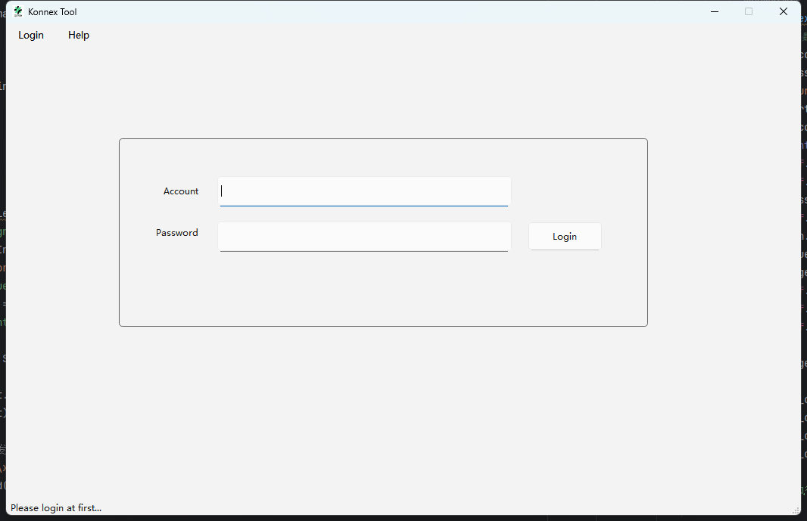


#### 5.1.2 连接 POS 机

1. 准备好 USB 串口线，将其一端稳固插入 POS 机的 USB 接口，另一端插入电脑的对应 USB 接口。

1. 在导出证书页面，认真检查并确认 POS 机设备已正确连接且处于准备就绪状态。通常可依据设备的指示灯状态或者页面上的提示信息来判断。

1. 点击页面中的 “START” 按钮，此时页面将进入连接 POS 机的进程。

1. 耐心等待连接过程完成。若连接成功，程序会自动跳转至工作页面；若连接失败，请检查 USB 线连接是否牢固、设备驱动是否正确安装等问题，解决后再次点击 “START” 尝试连接。

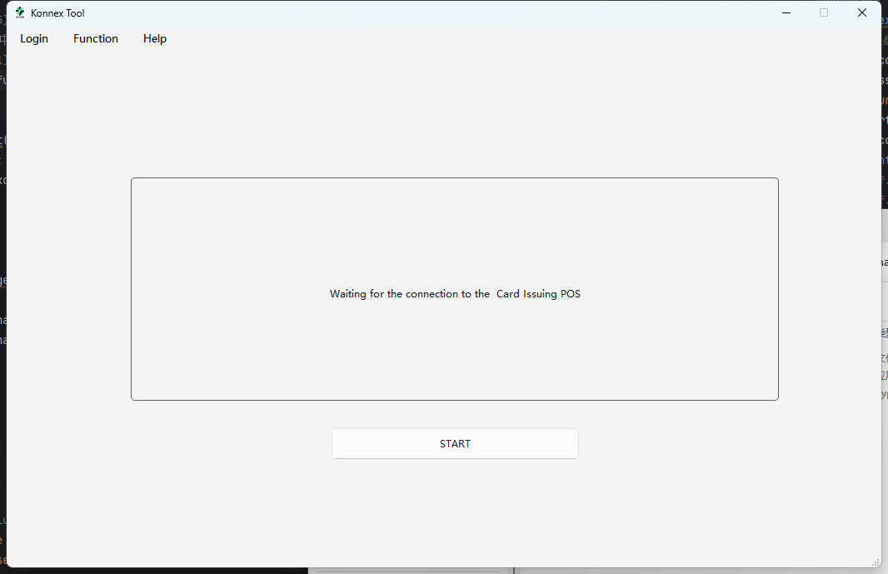


#### 5.1.3 选择串口设备并导出证书

1. 在工作页面的 “串口设备选择” 区域，点击下拉菜单，从显示的串口设备列表中，精准选择与当前所连接 POS 机对应的指定串口设备。

1. 确认串口设备选择无误后，点击页面上的 “Receive Certificate” 按钮，证书导出流程正式启动。


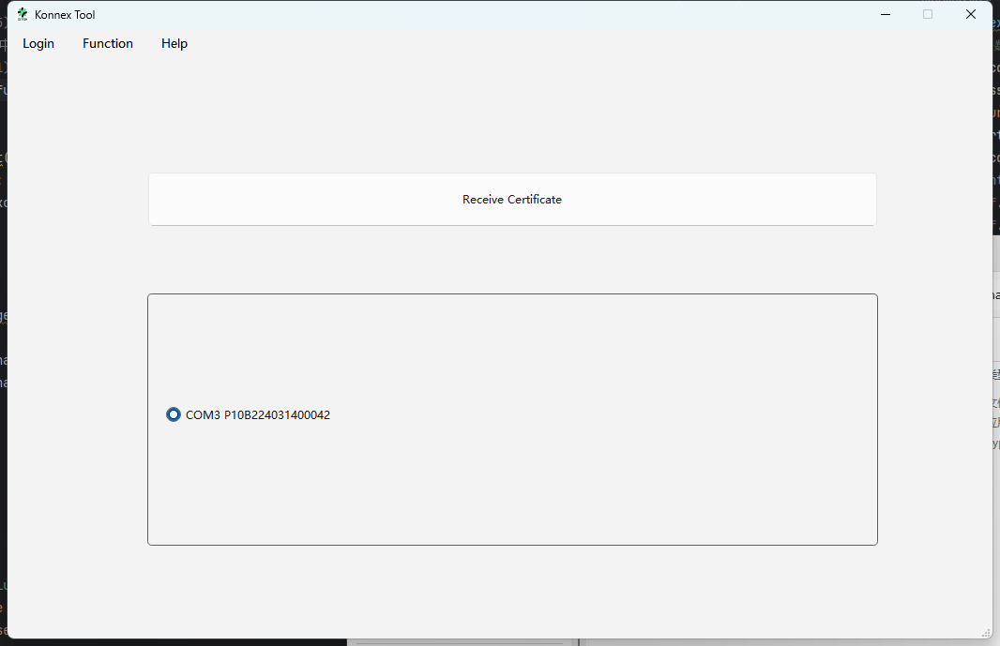


#### 5.1.4 证书保存

1. 导出证书过程需要一定时间，期间页面可能会显示导出进度条或相关提示信息。在此期间，请不要进行其他可能干扰导出进程的操作。

1. 当证书导出成功完成后，工具会自动将从选中设备中获取的证书链条保存到程序预设的目录下。一般而言，程序目录可在软件的设置选项中查看或自定义，默认保存路径通常为软件安装目录下的特定子文件夹（例如 “**receive_cert**” ）。


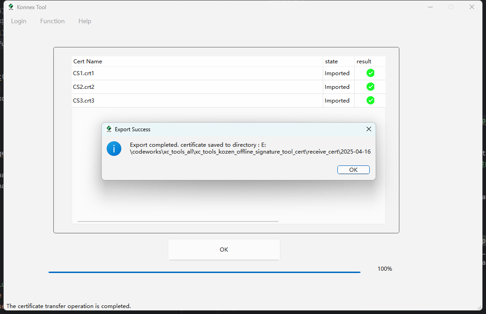


### 5.2 APK 签名功能

#### 5.2.1 登录并进入签名页面

1. 打开应用程序，在登录界面输入正确的账号和密码，完成登录操作。

2. 登录成功后，在页面菜单栏中找到并点击 “Function” 选项。

3. 在弹出的下拉菜单中，点击 “Sign Apk” 选项，此时系统将跳转到签名页面。


#### 5.2.2 连接 POS 机

1. 取来 USB 串口线，将其一端插入 POS 机的接口，另一端插入电脑的 USB 接口。
2. 在签名页面中，仔细确认 POS 机设备已正确连接且准备就绪（可通过设备指示灯状态或页面提示信息判断）。
3. 点击页面上的 “START” 按钮，系统页面将进入连接 POS 机的过程。
4. 等待片刻，如果连接成功，程序将自动跳转到工作页面。若连接失败，请检查设备连接是否稳固、驱动是否安装正确等问题，解决后重新点击 “START” 进行连接。

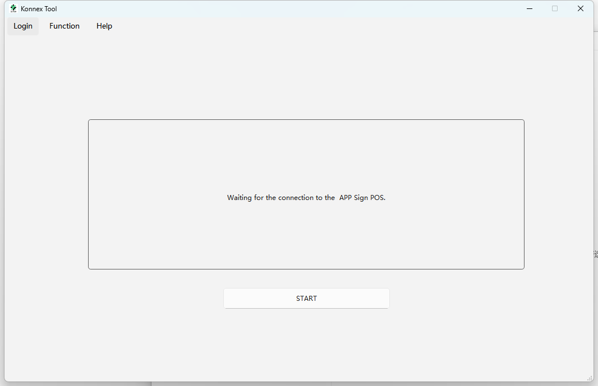


#### 5.2.3 选择 APK 及串口设备并进行签名

1. 在工作页面中，找到 “选择需要签名的 APK” 的操作区域，通过点击 “浏览” 按钮，在本地文件系统中定位并选中需要进行签名的 APK 文件。
2. 在页面的 “串口设备选择” 区域，点击下拉菜单，从列出的串口设备列表中选择与当前连接的 POS 机对应的指定串口设备。
3. 确认 APK 文件和串口设备均已正确选择后，点击页面上的 “OK” 按钮，签名流程正式启动。


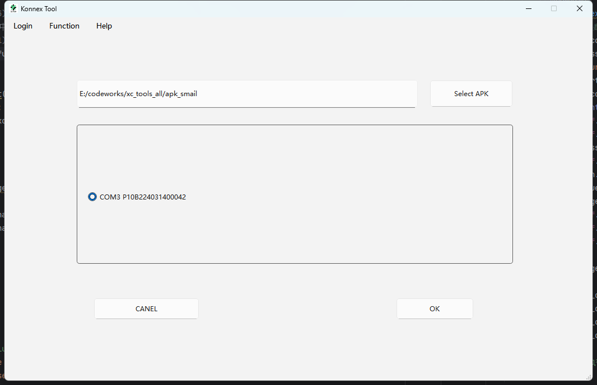


#### 5.2.4 签名结果保存

1. 签名过程需要一定时间，期间页面可能会显示签名进度条或相关提示信息。请耐心等待，不要进行其他可能干扰签名进程的操作。
2. 当签名成功完成后，工具会自动将签名后的 APK 文件导入设备，并保存到程序指定的目录下。一般情况下，程序目录可在软件的设置选项中查看或自定义，默认保存路径通常为软件安装目录下的特定子文件夹（如 “signed_apks” 等）。


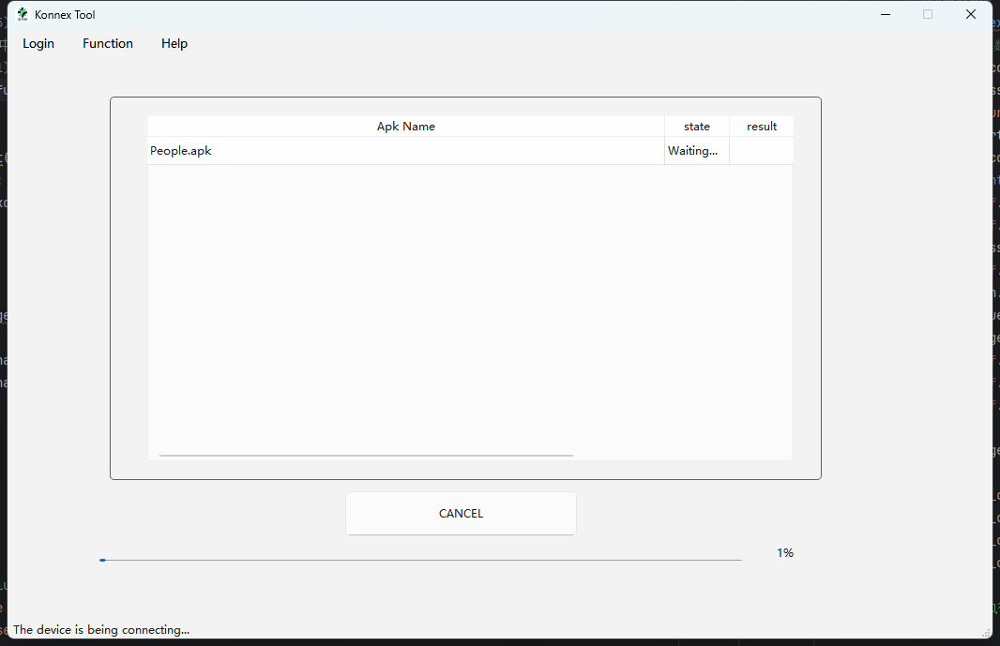


### 5.3 log功能


#### 5.3.1 **登录并进入日志页面**：

 打开应用程序，使用正确的账号和密码登录。登录成功后，在页面菜单栏中找到并点击 “Function” 选项。

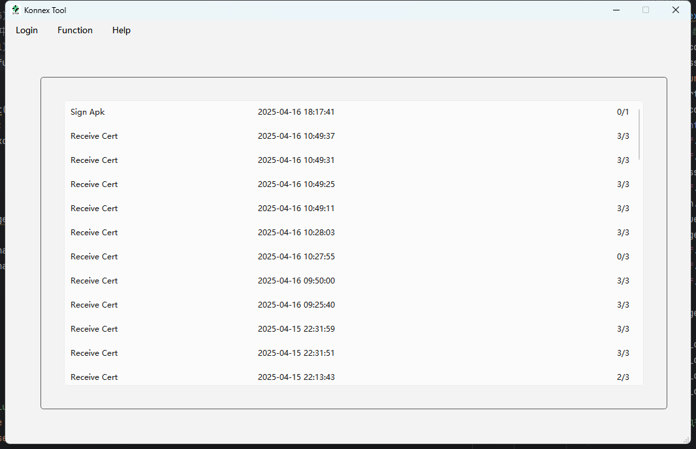

#### 5.3.2 查看日志 

  在 “Function” 的下拉菜单中，点击 “Log” 选项，此时将跳转至日志页面，在此页面中可查看 APK 签名和证书导出操作所生成的日志记录。日志通常按照操作时间顺序进行排列，最新的操作记录显示在最上方。


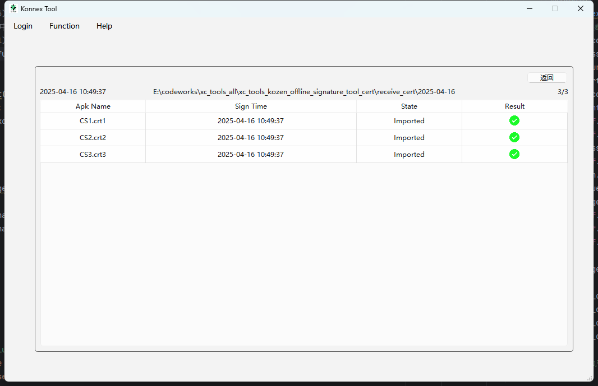


## 6. 通信协议

> 与com口的通讯协议有公共协议约定、检查客户端是否正常、发送签名、取消签名、接收文件、发送查看证书、导出证书、终止导出证书等接口，
>
> 具体查看  **离线签名串口协议.md** 协议文档,此处不做多的记录
>
> 


## 7. 错误处理与日志

### 7.1 错误类型与处理

本工具处理的主要错误类型包括：

- 串口连接错误：提示用户检查 COM 口和设备状态

- 通信超时：自动重试或提示用户检查设备响应

- 文件操作错误：提示用户检查文件路径和权限

- 签名失败：显示详细错误信息，如证书无效、密码错误等

  

### 7.2 日志系统

本工具使用 Python 的 logging 模块记录运行日志，日志级别可在配置文件中设置，支持以下级别：

- DEBUG：详细的调试信息
- INFO：正常运行信息
- WARNING：警告信息
- ERROR：错误信息
- CRITICAL：严重错误信息

日志文件默认保存在程序运行目录下的 log 文件夹中，按日期命名。


## 8. 维护与扩展

### 8.1 代码结构

主要文件和目录结构：

```plaintext
signing_tool/
├─app
│  │  __init__.py
│  │
│  ├─common 						# 公共模块,定义公共log,全局配置,全局异常等
│  │      config.py
│  │      log.py
│  │      models.py
│  │      __init__.py
│  │
│  ├─service						# 业务逻辑线程管理 & 串口管理 等
│  │      device_manager.py
│  │      generic_task.py
│  │      serial_device.py
│  │      serial_func_service.py
│  │      serial_port_listener.py
│  │      __init__.py
│  │
│  └─view							#自己写的页面,以ui库下文件为基础定义页面逻辑
│      │  main_window.py
│      │  widget_log.py
│      │  widget_login.py
│      │  widget_others.py
│      │  widget_sign_apk.py
│      │  __init__.py
│      │
│      ├─res						# 资源文件
│      │      fail.png
│      │      favicon.ico
│      │      success.png
│      │
│      └─ui							# pydesinger拖拽生成的界面
│              about.py
│              about.ui
│              funcExportCert.py
│              funcExportCert.ui
│              funcLog.py
│              funcLog.ui
│              funcSignApk.py
│              funcSignApk.ui
│              funcSignApk_bak.ui
│              guideExportCert.py
│              guideExportCert.ui
│              guideSignApk.py
│              guideSignApk.ui
│              login.py
│              login.ui
│              main_window.py
│              main_window.ui
│              __init__.py
│
└─tests
│        test.py
│        test_device.py
│        __init__.py
│  asyncio_test.py
│  asyncio_test2.py
│  logs.json
│  main.py							#主程序运行入口
│  main2exe.py						#打包程序入口
│  README.md
│  release_note.txt
│  requirements.txt					# 安装包依赖库清单
│  requirements_bak.txt
│  version_info.txt
│  离线签名串口协议.md					#COM口协议文档,


```

### 8.2 功能扩展与建议

1. 可以引入使用sqlite数据库存储日志替换现在的logs.json简单日志

2. 修改串口协议日志,让apk签一个发一个,(能规避掉现在一次性发送文件太大导致pos机设备签名不了apk)

3. 暂时只有这些...

   


## 9. 附录

### 9.1 注意事项

1. 确保使用的 POS 机设备与签名程序兼容，并按照设备说明书正确进行硬件连接和初始化设置。
2. 在签名过程中，不要随意插拔 POS 机的 USB 串口线，以免造成设备损坏或签名失败。
3. 若签名后的 APK 文件在使用过程中出现异常，可能是签名过程中出现了问题，建议重新进行签名操作，并仔细检查操作步骤是否正确。
4. 签名后的APK后缀改为 **.kpp** 同样可以进行安装等操作
5. 在证书导出过程中，切勿随意插拔 POS 机的 USB 串口线，以免损坏设备或导致导出失败。
6. 若导出的证书在后续使用过程中出现异常，可能是导出过程存在问题。建议重新进行导出操作，并仔细检查操作步骤是否正确。若问题仍然存在，请及时联系相关技术支持人员。


### 9.2 常见问题解答

1. **问题**：POS 机连接失败:  点击 “START” 后，页面长时间显示连接中或提示连接失败。
   **解答**： 
      - **USB 连接问题**：检查 USB 串口线两端是否插紧，尝试重新插拔 USB 线。若使用了 USB 扩展坞，可尝试直接将 POS 机连接到电脑的 USB 接口。
      - **驱动未安装或损坏**：前往 POS 机厂商官网，下载对应型号的最新驱动程序，然后在电脑上安装或重新安装驱动。安装完成后，重启电脑和 POS 机，再次尝试连接。
      - **串口被占用**：打开电脑的设备管理器，查看串口设备列表，确认所选串口未被其他程序占用。若被占用，关闭占用该串口的程序，或在签名程序中重新选择未被占用的串口。

2. **问题**：找不到需要签名的 APK 文件
   **解答**：

   - **文件路径错误**：确认 APK 文件所在的实际存储位置，检查在签名程序中浏览文件时选择的目录是否正确。可尝试逐步展开文件夹层级，手动定位到包含 APK 文件的文件夹。

   - **文件类型过滤问题**：部分签名程序可能默认只显示特定类型的文件（如.apk 文件）。在文件选择对话框中，查看是否有文件类型过滤选项，确保已将其设置为显示所有文件或明确选择了 APK 文件类型。


3. **问题**：签名失败, 点击 “OK” 后，签名过程未能成功完成，页面提示签名失败。
   **解答**：

     - **APK 文件损坏**：尝试获取一份新的、未损坏的 APK 文件，重新进行签名操作。可通过检查文件大小、校验和（如 MD5、SHA - 1 等）等方式确认文件的完整性。

   - **设备权限不足**：确保当前登录的用户对程序目录及相关文件、设备具有足够的读写和操作权限。对于一些需要特定权限才能访问的设备或目录，可尝试以管理员身份运行签名程序。

   - **签名工具与 APK 不兼容**：检查签名工具是否支持当前版本的 APK 格式或特定的应用类型。如有必要，升级签名工具或联系工具提供商获取技术支持。

     

4. **问题**：程序运行缓慢
   **解答**：检查系统资源使用情况，关闭其他占用资源的程序，考虑升级硬件配置


