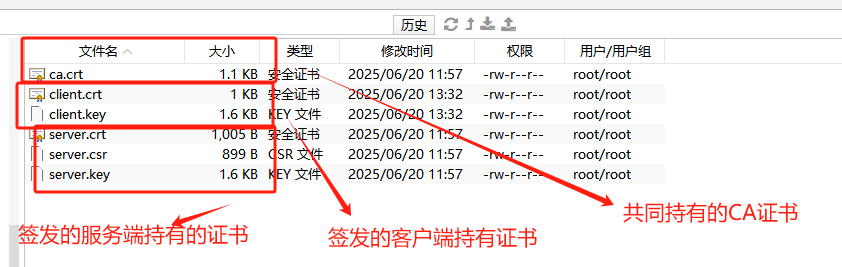
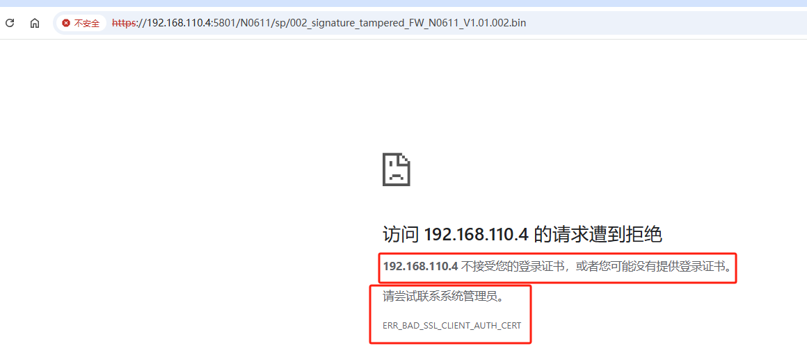
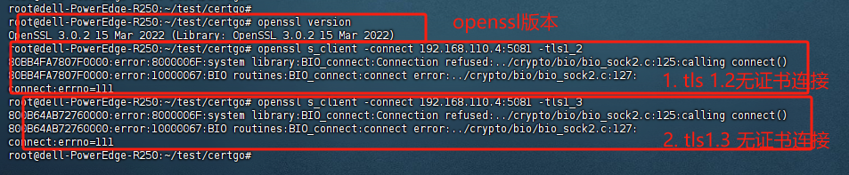
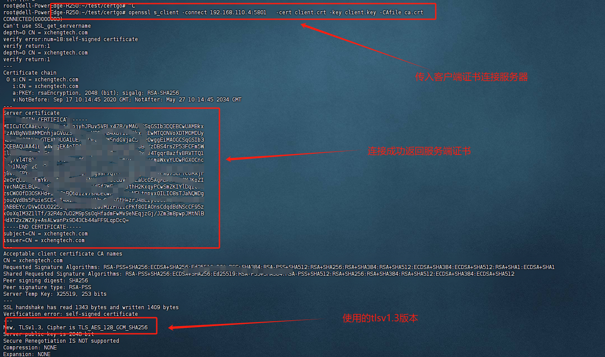

# PCI认证服务端实现


## 一、协议介绍 （公共前置内容）

TLS 1.2 和 TLS 1.3 是 **传输层安全协议（Transport Layer Security）** 的两个版本，用于在互联网通信中提供加密和身份验证功能。TLS 1.3 是 TLS 1.2 的升级版本，在安全性、性能和隐私方面都有显著改进。

下面是 TLS 1.2 和 TLS 1.3 的主要区别：

###  1、安全性增强

|                     |                                                              |                                                        |
| ------------------- | ------------------------------------------------------------ | ------------------------------------------------------ |
| **已知弱点**        | 存在一些可被利用的弱算法（如 RC4、CBC 模式下的 BEAST 攻击等） | 移除了所有不安全的旧算法                               |
| **支持的加密套件**  | 多种算法组合，包括不安全的 MD5、SHA-1、RSA 密钥交换等        | 只保留现代安全的算法，如 AES-GCM、ChaCha20-Poly1305 等 |
| **前向保密（PFS）** | 可选，很多实现默认不启用                                     | 强制要求使用，确保长期密钥泄露不影响历史通信安全       |


###  2、性能优化：握手过程简化

|                     |                                                              |                                                           |
| ------------------- | ------------------------------------------------------------ | --------------------------------------------------------- |
| 客户端到服务器      | ClientHello →                                                | ClientHello →                                             |
| 服务器响应          | ← ServerHello, Certificate, ServerKeyExchange, ServerHelloDone | ← ServerHello, EncryptedExtensions, Certificate, Finished |
| 密钥交换            | → ClientKeyExchange, ChangeCipherSpec, Finished              |                                                           |
| RTT（往返次数）     | 默认需要**2 RTT**（可以配置为 1 RTT）                        | **1 RTT**就能完成握手，更快建立连接                       |
| 0-RTT（零轮次握手） | 不支持                                                       | 支持（可提前发送数据，降低延迟）                          |

 **说明** ：

- TLS 1.3 把密钥交换逻辑大幅简化，把很多步骤合并。
- TLS 1.3 的 **0-RTT 模式** 允许客户端在第一个请求中就发送加密的应用数据，减少加载时间。


###  3、加密套件与算法改进

|               |                             |                                                              |
| ------------- | --------------------------- | ------------------------------------------------------------ |
| 密钥交换算法  | RSA、DHE、ECDHE             | 仅支持 ECDHE 和 DHE（强制前向保密）                          |
| 身份验证机制  | 使用 RSA 或 DH 进行身份验证 | 身份验证与密钥交换分离，更灵活                               |
| 加密+认证模式 | AEAD 和非-AEAD 都支持       | 仅支持**AEAD**（Authenticated Encryption with Associated Data），如 AES-GCM、ChaCha20-Poly1305 |
| 哈希函数      | 支持 SHA-1、MD5、SHA-256 等 | 仅支持 SHA-256 及以上（推荐 SHA-256、SHA-384）               |


###  4、移除不安全特性

TLS 1.3 明确禁止了以下在 TLS 1.2 中可能存在的不安全做法：

- RSA 密钥交换（易受攻击）

- 压缩（容易导致 CRIME 攻击）

- 自定义 Diffie-Hellman 参数（防止降级攻击）

- 旧版 CBC 模式

- 不安全的哈希算法（如 MD5、SHA-1）

  

###  5、总结对比表

|          |                            |                                 |
| -------- | -------------------------- | ------------------------------- |
| 发布时间 | 2008 年                    | 2018 年                         |
| 握手速度 | 较慢（2 RTT）              | 更快（1 RTT 或 0 RTT）          |
| 安全性   | 依赖实现是否禁用不安全算法 | 更高，默认启用现代安全算法      |
| 前向保密 | 可选                       | 强制启用                        |
| 加密套件 | 多种复杂选择               | 简化，仅保留安全选项            |
| 向后兼容 | 支持 TLS 1.1、1.0 等       | 不兼容 TLS 1.2 之前的协议       |
| 性能     | 相对较低                   | 更高效，适合移动网络和 CDN 场景 |


## 二、服务端实现逻辑


>  实现逻辑有多种，java、python启http服务、nginx配置证书、go启服务等都能实现，本服务使用的是GO语言开发


### 一、实现

* 实现双向认证服务端核心代码

  ``` go
  
  package main
  
  import (
  	"crypto/tls"
  	"crypto/x509"
  	"io/ioutil"
  	"log"
  	"net/http"
  )
  
  const path = "/uploadFiles"
  
  func startHTTPSServer() {
  	// 原来的 HTTPS 配置
  	rootCa := "./res/ca.crt"
  	serverCa := "./res/server.crt"
  	serverKey := "./res/server.key"
  	hostName := "xchengtech.com"
  	pool := newCertPool(rootCa)
  
  	s := &http.Server{
  		Addr:    ":5801",
  		Handler: http.FileServer(http.Dir(path)),
  		TLSConfig: &tls.Config{
  			ServerName: hostName,
  			ClientCAs:  pool,
  			ClientAuth: tls.RequireAndVerifyClientCert,
  		},
  	}
  
  	log.Printf("启动 HTTPS 文件服务在端口 :5801 ...")
  	err := s.ListenAndServeTLS(serverCa, serverKey)
  	if err != nil {
  		log.Printf("HTTPS server cannot run: %s", err.Error())
  	}
  }
  ```

  

 


上面代码中 **startHTTPSServer** 方法里面为主要实现方式， 使用的是 **net/http** 库，它是 go语言下**标准库实现**，设置了需要验证客户端证书，**tls v1.2**，**tls v1.3 ** 均可,主要看客户端采用哪种协议请求过来，

**&http.Server** 配置了对双向认证的要求实现，

**s.ListenAndServeTLS(serverCa, serverKey)**  启动端口监听客户端交换要求


### 二、验证


> 以如下文件获取为例 ，请求地址: https://192.168.110.4:5801/N0611/sp/002_signature_tampered_FW_N0611_V1.01.002.bin  (是局域网地址)




#### 1.  无证书验证不通

> 浏览器直接获取,后台开启了验证证书,验证不通过无法直接获取文件



* ssh命令验证

  * 从下图使用openssl方式验证连接服务端连接并双向同步，tls1.2版本和tls1.3没有给到客户端证书都没有连接成功

  

  


#### 2. 有证书能验证通过


* ssh命令验证

  > 下图中指明客户端证书与ca文件，可以验证通过

  

  

  