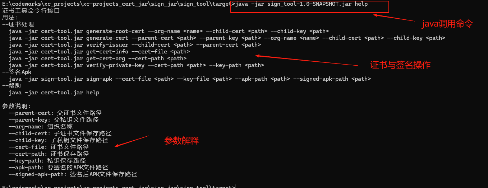

### 封装java jar包工具 制作子证书与 签名apk功能

## 业务需要,封装java


## 工具使用

> 提供jar包供应使用, 使用方式有两种


### 1.  java -jar xxx.jar 命令使用

  > 由提供的   sign_tool-x.x-RELEASE.jar 到安装好jdk环境中使用命令,  java -jar 获取支持的功能

  

  ``` shell
  
  java -jar sign_tool-1.0-SNAPSHOT.jar help
  证书工具命令行接口
  用法:
  --证书处理
    java -jar cert-tool.jar generate-cert --parent-cert <path> --parent-key <path> --org-name <name> --child-cert <path> --child-key <path>
    java -jar cert-tool.jar verify-issuer --child-cert <path> --parent-cert <path>
    java -jar cert-tool.jar get-cert-info --cert-file <path>
    java -jar cert-tool.jar get-cert-org --cert-content <content>
    java -jar cert-tool.jar verify-private-key --cert-content <content> --key-content <content>
  --签名Apk
    java -jar sign-tool.jar sign-apk --cert-file <path> --key-file <path> --apk-path <path> --signed-apk-path <path>
  --帮助
    java -jar cert-tool.jar help
  
  参数说明:
    --parent-cert: 父证书文件路径
    --parent-key: 父私钥文件路径
    --org-name: 组织名称
    --child-cert: 子证书文件保存路径
    --child-key: 子私钥文件保存路径
    --output-cert: 输出证书文件路径
    --output-key: 输出私钥文件路径
    --cert-file: 证书文件路径
    --cert-content: 证书内容
    --key-content: 私钥内容
    --apk-path: 要签名的APK文件路径
    --signed-apk-path: 签名后APK文件保存路径
  ```

  

### 2. maven依赖对应库后 使用

  >  maven 添加提供的阿里云maven中央仓库,  

  ``` java
  
  // maven添加对应的阿里云仓库地址 settings.xml配置
  
  <servers>
    <server>
      <id>2048678-release-Cfs7mt</id>
      <username>5fb32796a3bcee4a48c8db2d</username>
      <password>************</password>
    </server>
  </servers>
  
  <repositories>
    <repository>
      <id>2048678-release-Cfs7mt</id>
      <url>https://packages.aliyun.com/5fb327ec22a8c7ff393513ea/maven/2048678-release-cfs7mt</url>
      <releases>
        <enabled>true</enabled>
      </releases>
      <snapshots>
        <enabled>true</enabled>
      </snapshots>
    </repository>
  </repositories>
  
  
  // 并且在pom.xml下面 添加如下maven依赖配置
   
  <dependency>
    <groupId>com.xcheng.apex.kozen.signtool</groupId>
    <artifactId>sign_tool</artifactId>
    <version>1.0-SNAPSHOT</version>
  </dependency>
  
  
  ```

  


## 工具接口

> 因为秘钥与证书属于重要敏感文件,接口上建议都使用多都以文件为主, 入参出参都传有效文件绝度路径

### 1. 生成子证书

> 因为根证书未公开, 故上层证书由此接口生成


* 命令

  >  

  ``` shell
  java -jar sign_tool-1.0-SNAPSHOT.jar generate-root-cert --org-name orgtest1 --child-cert orgtest1.crt --child-key orgtest1.key
  
  证书生成成功:
  证书已保存到: orgtest1.crt
  私钥已保存到: orgtest1.key
  
  ```

  

* 代码

  >   

  ``` java
  
  
  ```

  


### 2. 生成2级/ N级子证书

> 二级至后面的证书由此接口生成

* 命令

  >  

  ``` shell
  java -jar sign_tool-1.0-SNAPSHOT.jar generate-cert --parent-cert orgtest1.crt --parent-key orgtest1.key --org-name orgtest1_sub1 --child-cert orgtest1_sub1.crt --child-key orgtest1_sub1.key
  
  证书生成成功:
  证书已保存到: orgtest1_sub1.crt
  私钥已保存到: orgtest1_sub1.key
  ```

  

* 代码

  >   

  ``` java
  
  ```

  


### 3. 获取证书所有信息

> 

* 命令

  >  

  ``` shell
   java -jar sign_tool-1.0-SNAPSHOT.jar get-cert-info --cert-file orgtest1_sub1.crt
   
  Subject: CN=orgtest1_sub1, OU=Department, O=Organization
  Issuer: CN=orgtest1, OU=Department, O=Organization
  Serial Number: 1755684011245
  Not Before: Tue Aug 19 18:00:11 CST 2025
  Not After: Thu Aug 20 18:00:11 CST 2026
  Signature Algorithm: SHA256withRSA
  ```

  

* 代码

  >   

  ``` java
  
  ```

  


### 4. 校验子级证书,是否由上一级签发

> 

* 命令

  >  

  ``` shell
  \sign_tool\target> java -jar sign_tool-1.0-SNAPSHOT.jar verify-issuer --child-cert orgtest1_sub1.crt --parent-cert orgtest1.crt
  
  验证成功: 子证书由父证书签发
  ```

  

* 代码

  >   

  ``` java
  
  ```

  


### 5. 获取证书拥有者的组织名称

> 

* 命令

  >  

  ``` shell
  java -jar sign_tool-1.0-SNAPSHOT.jar get-cert-org --cert-path orgtest1_sub1.crt
  
  证书组织名称: Organization
  ```

  

* 代码

  >   

  ``` java
  
  ```

  


### 6. 验证私钥是否正确

> 

* 命令

  >  

  ``` shell
  # 匹配的证书
  java -jar sign_tool-1.0-SNAPSHOT.jar verify-private-key --cert-path orgtest1_sub1.crt --key-path orgtest1_sub1.key
  验证成功: 私钥与证书匹配
  
  # 不匹配的证书
  java -jar sign_tool-1.0-SNAPSHOT.jar verify-private-key --cert-path orgtest1_sub1.crt --key-path orgtest1.key
  验证失败: 私钥与证书不匹配
  
  ```

  

* 代码

  >   

  ``` java
  
  ```

  


### 7. 证书签名App

> 

* 命令

  >  

  ``` shell
  java -jar sign_tool-1.0-SNAPSHOT.jar sign-apk --cert-file orgtest1_sub1.crt --key-file orgtest1_sub1.key --apk-path People.apk --signed-apk-path People_signed1.apk
  
  APK签名成功！
  签名文件保存在: E:\codeworks\xc_projects\xc-projects_cert_jar\sign_jar\sign_tool\target\People_signed1.apk
  ```

  

* 代码

  >   

  ``` java
  
  ```

  


